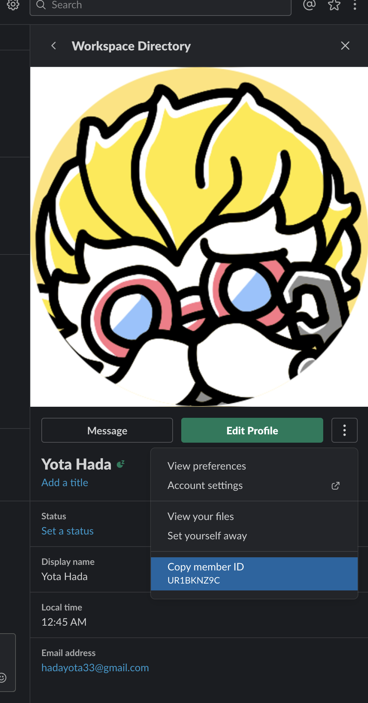
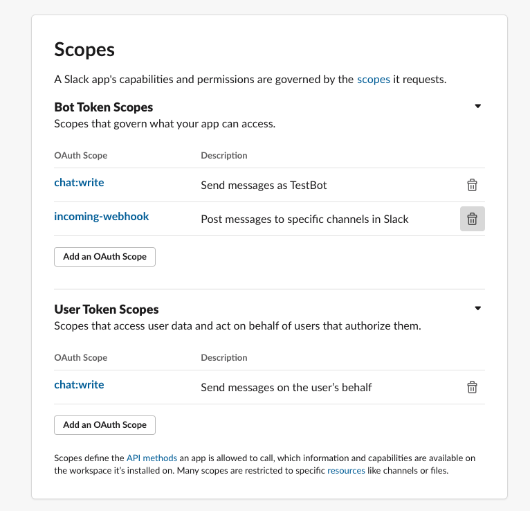

# Slack Web API
間違ってる点があればご指摘ください！

調べてみた結果、特定のチャンネルでしかやりとりしない場合はwebhookの方が良さそうで  
複数チャンネルでいろんなことしたい場合はtokenのが良さそうかと


## 概要
Slack Web APIを使用して特定のチャンネルにメッセージを送るには下記二つの方法がある

1. Incomming webhook
2. OAuth Access Token

ハダの主観の比較表

|機能|webhook|token|
|---|---|---|
|チャンネル送信|webhookURLが発行されたチャンネルのみ|どのチャンネルでもOK|
|ユーザとして送信|Botとしてのみ|○(チャネルに属してるユーザとして)|
|token・webhookurlが漏洩した場合|対象チャンネルにメッセージを送られる|スコープによっては好き勝手される|
|設定のしやすさ|webhookURL発行するだけ|わかりづらいスコープの設定が必要|
|ユーザへのメンション|○|○|


## 共通項目
最近webhookの方式も新しくなったらしいので  
webhook使うにしろtokenを使うにしろ
**Slackアプリの作成**はしといた方が良さそうです

[新方式の参考記事](https://qiita.com/kshibata101/items/0e13c420080a993c5d16#%E6%96%B0%E6%96%B9%E5%BC%8F)

メンションする場合もメッセージ内でメンション用の[記法](https://qiita.com/ryo-yamaoka/items/7677ee4486cf395ce9bc#%E8%A8%98%E6%B3%95)を使用すればよし

|記法|メンション|
|---|---|
|<!here>|@here|
|<!channel>|@channel|
|<@user_id>|@yota|

メッセージの表現方法はattachmentsが非推奨でblocksが[推奨されてる](https://api.slack.com/messaging/attachments-to-blocks)のでblocksで書いた方良さそうで、LaravelのNotificationヘルパではblocksの対応はされてないので今回は自前で実装しました


ユーザへ個別にメンションを飛ばす場合はユーザーIDが必要なのでユーザーIDを登録してもらう必要があります。

<p align="center"></p>


## webhook
特定のチャネルに対してメッセージを送信することができるURLを発行してくれる

<p align="center"></p>

### webhookで送信を行うためにユーザがやること
1. slack appの作成
2. ワークスペースにappをインストール
3. incoming webhooksのアクティベート
4. 通知先用(チャンネルorユーザ)のwebhookURLを追加する
5. 発行したwebhook urlをimproで登録
6. メンションを飛ばしたいユーザのIDを取得しimproで登録

### 実装例
今回はHTTPリクエスト生成するのにGuzzle使ってます

```php
$client = new \GuzzleHttp\Client();

$response = $client->request('POST', '{発行されたwebhookURL}',
    [
        'json' => [
            'text' => 'text',
            'blocks' => [
                [
                    'type' => 'section',
                    'text' => [
                        "type" => "mrkdwn",
                        "text" => "<@ユーザID>テストテスト"
                    ]
                ],
                [
                    'type' => 'context',
                    'elements' => [
                        [
                            'type' => 'mrkdwn',
                            'text' => 'コンテキスト'
                        ]
                    ]
                ],
            ],
        ]
    ]
);
```

## OAuth Access Token

APIでできる権限(スコープ)を設定し、そのトークンを発行。  
発行されたトークンを使用しSlackのWeb APIエンドポイントへ直接リクエストを送ることでメッセージを送信する

ドキュメントしっかりとは読んでないので間違いあるかもしれませんが  
APIでできる権限とは
- ユーザー情報の取得・追加・削除
- メッセージの取得・送信・削除
- チャンネルの取得・登録・削除

など強い権限になればなるほどなんでもAPI経由でできるかと 
おそらくtokenを使う場合はtokenをうちのDBに保存することになるので  
漏洩のことも考えるとあんまり権限つよいトークンは保存したくない・・・

<p align="center"></p>


### tokenで送信を行うためにユーザがやること
1. slack appの作成
2. ワークスペースにappをインストール
3. メッセージ送信用のscope付与
4. 発行されたアクセストークンをimproに登録
5. メンションを飛ばしたいユーザーのIDをimproに登録


### 実装例
```php
$headers = [
    'Authorization' => 'Bearer {アクセストークン}',
    'Content-Type'  => 'application/json; charset=utf-8',
];

$url = 'https://slack.com/api/chat.postMessage';

$response = $client->request('POST', $url,
    [
        'headers' => $headers,
        'json' => [
            'channel' => '{チャネル名}',
            'text' => 'aaaaaaa',
            'blocks' => [
                [
                    'type' => 'section',
                    'text' => [
                        "type" => "mrkdwn",
                        "text" => "<@ユーザーID>テストテキスト"
                    ]
                ],
                [
                    'type' => 'context',
                    'elements' => [
                        [
                            'type' => 'mrkdwn',
                            'text' => 'コンテキスト'
                        ]
                    ]
                ],
            ],

            // NOTE: ユーザとして送信する場合は下記プロパティも追加
            // 'as_user' => 'true',
            // 'username' => '{ユーザ名}',
        ]
    ]
);

```